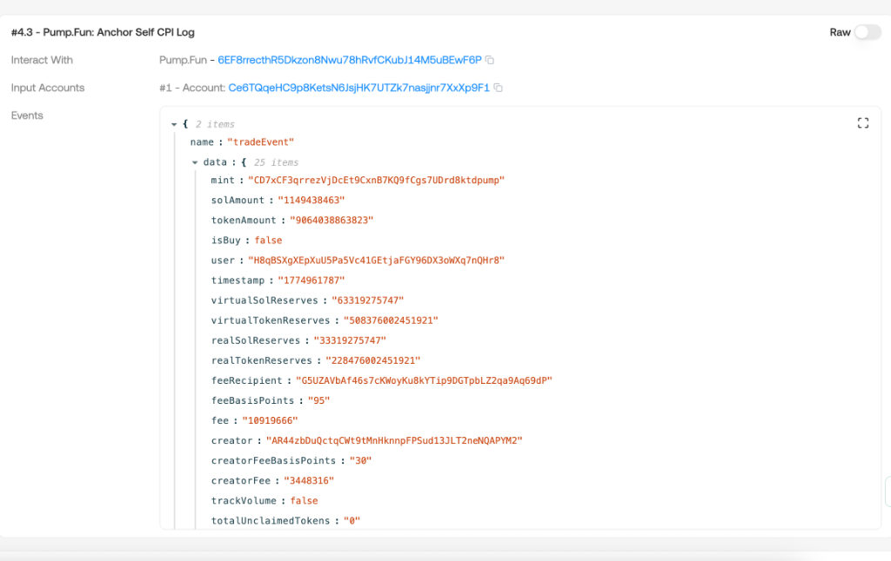

## TL;DR

Anchor 的 `emit!` / `emit_cpi!` 并不是简单地往 `logMessages` 里写一行日志——它会让**当前 program 调用自己（Self‑CPI）**，把序列化的 event 数据塞到这条 CPI 的 `instruction.data` 里，最终被记录在交易的 `InnerInstructions` 中。

这条 Self‑CPI **几乎总是出现在 `InnerInstructions` 的最后一条**，这是框架刻意的约定，而非巧合。

---

## 一个真实的例子：Pump.Fun 的 tradeEvent

下图是一笔 Pump.Fun swap 交易在 explorer 中的展示。注意看 `#4.3` 这条指令——它标注为 **"Anchor Self CPI Log"**，也就是我们今天要讨论的主角：



可以看到：

- **Interact With** 字段显示的 program 与外层指令的 program 完全相同（`6EF8rrecthR5Dk...`，即 Pump.Fun 程序本身）
- **Events** 区域解析出了一个结构化的 `tradeEvent`，包含 `mint`、`solAmount`、`tokenAmount`、`isBuy`、`user` 等 25 个字段
- 这条指令是整个交易 inner instructions 中的**最后一条**

这就是 Anchor Self‑CPI Event 的典型形态。

---

## 实现机制：为什么是"自调用"？

### emit! 与 emit_cpi! 的本质

在 Anchor 源码中，`emit!` 和 `emit_cpi!` 的核心逻辑是：

```rust
// 简化的伪代码
pub fn emit_cpi(event_data: Vec<u8>) {
    // 1. 构造一条指向自身 program_id 的 CPI 指令
    let ix = Instruction {
        program_id: *program_id,  // 调用自己
        accounts: vec![],         // 通常不需要额外账户
        data: event_data,         // event 的 borsh 序列化数据
    };

    // 2. 通过 invoke() 执行这条 CPI
    invoke(&ix, &[])?;
}
```

关键点在于：

| 特性 | 说明 |
|------|------|
| **program_id** | 指向自身，所以叫 "Self‑CPI" |
| **accounts** | 通常为空或只包含一个 event authority PDA |
| **data** | event 结构体的 borsh 序列化字节，前 8 字节是 event discriminator |
| **位置** | 框架把这条 CPI 放在指令执行的最后一步 |

### 为什么放在最后？

这不是技术上的硬限制，而是 Anchor 框架的**约定（convention）**：

1. **避免干扰业务逻辑顺序**：所有"真正的"CPI（比如 SPL Token 转账）先执行完毕，event 只是"事后记录"
2. **便于模式识别**：解析器可以直接跳到 `InnerInstructions` 的末尾去查找 event，而不需要在所有指令中遍历
3. **保证数据一致性**：event 记录的是指令执行完成后的最终状态，而不是中间状态

---

## 为什么不直接用 logMessages？

这是一个常见的疑问。Solana 原生的 `msg!()` 宏也可以输出日志，早期的 Anchor 版本确实是用 `msg!()` + base64 编码来实现事件的。但 Self‑CPI 方式有几个关键优势：

### 1. 绕开 log 长度限制

Solana 的 `logMessages` 有 **10 KB 的截断限制**。当一笔交易包含大量 CPI 调用时（比如 Jupiter 聚合器路由多个 DEX），log 空间很容易被消耗完毕，导致 event 数据被丢弃。

而 `InnerInstructions` 中的 CPI data **不受这个限制**，可以安全地携带较大的 event 结构体。

### 2. 天然绑定上下文

通过 inner instruction，event 自带以下上下文信息：

```
├── Transaction
│   ├── Instruction #1 (Top-level: Jupiter Swap)
│   │   ├── Inner #1.1 (CPI: Raydium swap)
│   │   ├── Inner #1.2 (CPI: SPL Token transfer)
│   │   ├── Inner #1.3 (CPI: Raydium event) ← Raydium 的 Self-CPI
│   │   ├── Inner #1.4 (CPI: Orca swap)
│   │   ├── Inner #1.5 (CPI: SPL Token transfer)
│   │   └── Inner #1.6 (CPI: Orca event)    ← Orca 的 Self-CPI
```

每条 event 都精确绑定到：

- **哪个 program** 发出的（通过 `program_id`）
- **属于哪条顶层指令**（通过 instruction index）
- **在调用链中的位置**（通过 inner instruction 的层级）

如果只用 `logMessages`，所有日志都是平铺的字符串，你需要额外的解析逻辑来推断"这行 log 是哪个 program 在哪个 CPI 层级输出的"。

### 3. 为索引器提供结构化入口

主流的链上索引器（如 Helius、Shyft）和 explorer（如 SolanaFM、Solscan）可以自动识别 `InnerInstructions` 中的 self‑CPI，直接把 borsh 数据反序列化为人类可读的 event 结构。

流程对比：

| 方式 | 解析流程 |
|------|----------|
| **logMessages** | 遍历所有 log → 正则匹配 "Program data:" 前缀 → base64 解码 → borsh 反序列化 → 猜测归属 program |
| **Self‑CPI** | 遍历 InnerInstructions → 找到 `program_id == parent_program_id` 的指令 → 直接 borsh 反序列化 → 上下文天然绑定 |

---

## 如何识别一条 Self‑CPI Event

当你在解析交易数据时，可以用以下规则来判断：

```
如果一条 InnerInstruction 满足：
  1. program_id == 父级指令的 program_id（自调用）
  2. data 的前 8 字节是合法的 event discriminator
  3. 通常位于同级 inner instructions 的最后一条
→ 它就是一条 Anchor Event Self‑CPI
```

Event 的 discriminator 生成规则与 instruction discriminator 类似，但前缀不同：

```rust
// Instruction discriminator
sha256("global:<instruction_name>")[..8]

// Event discriminator
sha256("event:<EventName>")[..8]
```

如果你已经阅读过 [What is discriminator in Solana Anchor Framework](/zh/blog/2026/what-is-discriminator-in-solana-anchor-framework)，这个模式应该很熟悉。

---

## 实际开发中的注意事项

### emit! vs emit_cpi!

| 宏 | 行为 | 适用场景 |
|----|------|----------|
| `emit!()` | 使用 `msg!()` 写入 logMessages | 旧版 Anchor（< 0.29），简单场景 |
| `emit_cpi!()` | 通过 Self‑CPI 写入 InnerInstructions | 推荐方式，尤其是复杂交易 |

从 **Anchor 0.29+** 开始，`emit_cpi!` 成为推荐的事件发送方式。

### 在 Go/Rust 客户端中解析 Event

如果你在构建链上索引器（就像我们之前讨论的 Solana DEX consumer），解析 Self‑CPI event 的步骤是：

```go
// 伪代码
for _, innerIx := range tx.Meta.InnerInstructions {
    for _, ix := range innerIx.Instructions {
        programId := tx.Message.AccountKeys[ix.ProgramIdIndex]

        // 找到 Self-CPI：program_id 与外层指令的 program 相同
        if programId == expectedProgramId {
            discriminator := ix.Data[:8]

            switch {
            case bytes.Equal(discriminator, tradeEventDisc):
                event := DecodeTradeEvent(ix.Data[8:])
                // 处理 event...
            }
        }
    }
}
```

### 边界情况：嵌套 CPI 中的 Event

当 Program A 调用 Program B，而 B 又 emit 了事件时，B 的 Self‑CPI 会出现在 A 的 inner instructions 中。此时：

- B 的 event 的 `program_id` 是 B 自己的地址
- 但它作为 inner instruction 挂在 A 的顶层指令下

这意味着你不能只看"是否在最后一条"来判断——在多层 CPI 的场景中，需要检查 **program_id 的自引用关系**，这才是最可靠的识别方式。

---

## 总结

| 维度 | 设计决策 |
|------|----------|
| **机制** | Self‑CPI：program 调用自己，event 数据作为 instruction data |
| **位置** | 通常在 InnerInstructions 的最后一条（约定，非硬限制） |
| **优势** | 保留上下文、结构化、可预测、不受 log 截断限制 |
| **识别** | program_id == parent program_id + event discriminator 前缀 |
| **推荐** | Anchor 0.29+ 使用 `emit_cpi!`，替代旧的 `emit!` |

**把 event 附在 `InnerInstructions` 最后一条 Self‑CPI 里，是 Anchor 为了"保持上下文、结构化、可预测、且不被 log 截断"而设计的约定模式。** 理解这个机制，无论是写链上程序、构建索引器、还是调试交易，都会事半功倍。

---

## 参考资料

- [Anchor Events Documentation](https://www.anchor-lang.com/docs/events)
- [Solana Inner Instructions](https://solana.com/docs/rpc/json-structures#inner-instructions)
- [BCSkill - Solana 优秀转载](https://www.bcskill.com/index.php/category/Solana-%E4%BC%98%E7%A7%80%E8%BD%AC%E8%BD%BD/)
