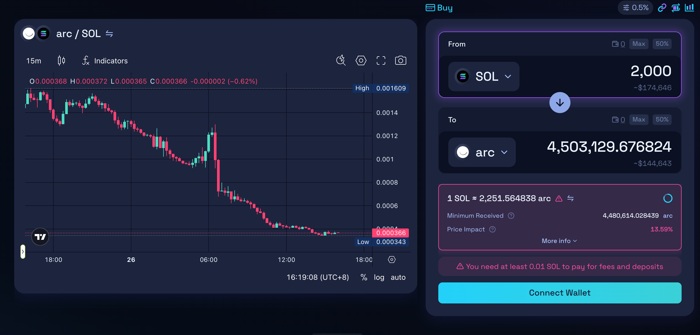

## What is slippage?

滑点就是一笔交易下单时和实际成交时的价格差。

## Why does slippage happen fundamentally?

造成滑点本质的原因是AMM池子的定价公式(x \* y = k)所造成的。

x: 代币A的数量
y: 代币B的数量
k: 常数

当你往池子里用A换一大笔B时, x增加, y减少, 为了保证k不变, 你需要用更多的A来换取更少的B, 这就是滑点。

比如SOL/USDC池子, 池子里现在有：
100 SOL
100000 USDC

那么 k = 100 \* 100000 = 10000000,

1 SOL ≈ 1000 USDC

用户：用 USDC 买 SOL(有滑点)
用户想用 10000 USDC 买 SOL。
他心里的理想想法是：“现在 1 SOL ≈ 1000 USDC, 那我应该能买到 10 SOL。”

实际上通过AMM的结果,

1.初始的池子:

```ts
x前 = 100;
y前 = 100000;
k常数不变 = 10000000;
```

2.用户加入10000 USDC后, 池子变成了：

```ts
y后 = 100000 + 10000 = 110000;
```

3.为了保持x \* y = k常数不变

```ts
x后 * 110000 = 10000000
x后 = 10000000 / 110000 = 90.91SOL;
```

4.用户最终实际换到的SOL数量是:

```ts
换出 SOL 数量 = 原来 SOL - 新的 SOL
得到的 SOL ≈ 100 - 90.91 = 9.09 SOL
```

## Why is slippage higher for large transactions?

因为大额交易会占用更多的池子流动性(影响池子的定价公式), 导致池子价格波动更大, 从而产生更高的滑点。

## What is the relationship between liquidity and slippage?

流动性越强，滑点越低。流动性越弱，滑点越高。

## The reasons why slippage happens The factors that affect slippage and the reasons why they affect it

核心是：滑点 =「你以为成交的价格 / 数量」和「实际成交的价格 / 数量」之间的差异，这个差异是多种因素叠加出来的

AMM 机制本身导致的滑点因素:

`````ts
这些是天然产生的:

1. 池子深度(池子中两种货币的数量多不多)
池子里的两种货币储备量越大, 同样规模的交易对曲线的'拉动'越小, 价格变动越小, 滑点越小;

2. 单笔订单规模(你这笔单子占池子的比例)
交易量占池子储备的比例越大，常数乘积曲线上价格就会被推得越远，实际成交价和你点单那一刻看到的「起始价」差距越大，滑点越明显。

3. 做市函数的形状
不同 AMM 曲线不同：

恒定乘积 x \* y = k 曲线比较弯，大额单子价格变动快，滑点高。

稳定币池(类似 Curve 的混合曲线)在 1:1 附近更接近直线，小额区间几乎无滑点，大额才明显。

集中流动性(CLMM)在选定区间内滑点很低，但一旦价格冲出区间，滑点会突然变得很大。

4. 交易方向和池子当前状态

如果池子里 SOL 很少、USDC 很多，你再用 USDC 买 SOL, 就会把本来就稀缺的 SOL 拉得更贵，滑点更大。
反过来，往多的一侧丢货、拿少的一侧，一般滑点更明显。

市场与流动性相关的因素:

````ts
这些更偏向于市场环境：

1. 整体流动性好坏
某个币在多个池子、多个交易所里整体深度都很差(长尾小币、刚上线的新币), 哪怕你只下一单几千U, 滑点都可能很夸张; 主流币大池子上, 即使几万、几十万U, 滑点也可能不高。ps. 在一级市场里玩meme币的散户, 经常会遇到这种情况。

2. 波动率(价格波动幅度)
行情剧烈波动时, 同一段时间里内会有很多人一起买卖同一个池子, 价格不断被前后几笔交易推高/推低, 你能成交到的最终价格和你下单时看到的「参考价」差距更大。

3. 市场流动性(池子流动性)
池子流动性越大，滑点越小；池子流动性越小，滑点越大。

4. 聚合器/大单拆分逻辑
有些聚合器会把你的订单拆到多个池子里成交，理论上是为了减少滑点；但如果其中某个小池子被打穿了，也可能拉高整体平均成交价。

链上技术与执行相关的因素:

这是「你点完按钮到真正成交」之间的风险：

区块链网络拥堵、确认延时
你发出交易时看到的是当时池子的价格，但交易真正被打包上链时，池子的储备可能已经被别人改过几轮了：

如果中间有人先买了一大笔，你的交易就会在一个更高的价格上成交，滑点变大。

如果项目在冷门链上、出块慢，这种情况更明显。

交易排序 / MEV / 抢跑

前置(Front-running): Bot 看到你要买一大笔，先帮你买一笔再卖给你，使你实际成交价更差(滑点更大)。

夹心(Sandwich): Bot 在你前后各下一笔，把你“夹”在中间，专门吃你这笔交易的滑点空间。
这些都会让你实际滑点远高于「按 AMM 曲线理论上应该有的价格变化」。

手续费与价格显示方式
一些前端展示的「预计获得数量」是已经扣了手续费的，有些是没扣的，你心理预期如果没把手续费算进去，也会把部分费用误以为是滑点。

`````

「影响滑点」 vs 「导致滑点」可以怎么理解

“结构性”导致滑点的东西（本质不可避免）：

- AMM 曲线的形状(恒定乘积、稳定币曲线、CLMM 等)
- 池子深度、你这笔单子相对池子的大小

  这些决定：只要有人成交，就一定会有价格被推移，滑点是机制内生的"隐形税"。

“放大或缩小滑点”的东西（影响实际体验）：

- 市场波动大不大、币种是否冷门
- 链上是否拥堵、有没有 MEV/抢跑
- 前端默认的滑点容忍度设置(0.5%、1%、5% 等)

> 真正的滑点有两层：
> 一层是 AMM 曲线和池子深度决定的“理论滑点”；
> 另一层是网络拥堵、MEV、行情波动等叠加出来的“额外滑点”。

## Find a liquidity pool on Raydium and calculate the slippage

我们从[Raydium](https://raydium.io/)上随便找一个流动性池子作为初始价格, 设定交易数量后计算实际到手的Token数量以及滑点百分比与实际造成的损失。



(预期获得 - 最低接收) ÷ 预期获得 = 滑点比例

即：(4,503,129.67 - 4,480,614.02) ÷ 4,503,129.67 ≈ 0.005 (即 0.5%)。
