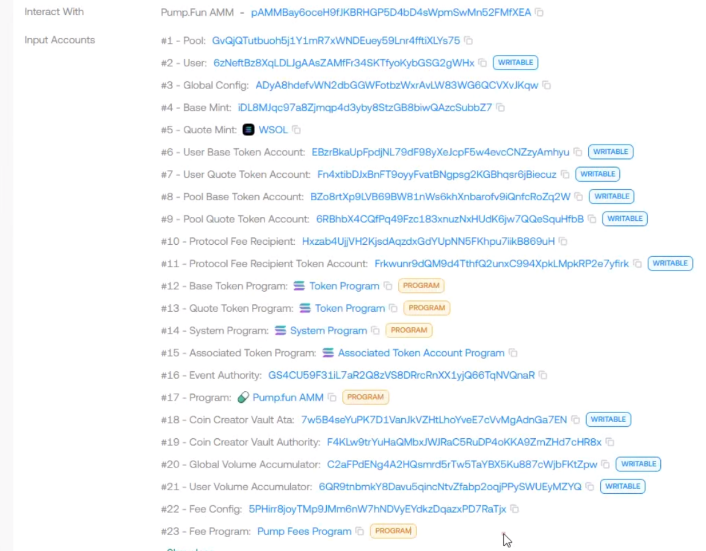

图中可以看到, 这是pumpfun的某个池子里的一笔buy交易, 一次交易涉及了足足23个账户, 我们一起探讨一下这些账户的扮演的角色和作用。

## 前置知识: Solana的账户类型

在深入之前，建议先阅读 [如何理解 Solana 账户关系](/zh/blog/2026/how-to-clarify-solana-account-relationships) 以建立账户模型的基础认知。

根据文档[https://solana.com/docs/core/accounts](https://solana.com/docs/core/accounts), Solana官方把账户分成两大类:

**Program Account**:

- executable = true.

- 存放可执行代码(BPF 程序), 例如 System Program、SPL Token Program、Stake Program 等。

**Data Account**:

- executable = false.

- 存放任意状态数据, 包括: 普通用户钱包、Token Account、Mint Account、PDA、ATA、Stake Account、Vote Account 等。

**所有账户都有这些通用字段**: lamports、data、owner(拥有该账户的程序)、executable、rent_epoch。

**SPL(Solana Program Library)是 Solana 区块链上管理代币的标准协议和工具集。**

SPL 定义了同质化代币Fungible Tokens(比如meme币)和非同质化代币NFT的创建、转账、销毁等操作,所有 Solana 代币都基于此标准。

- Token Program(代币程序，地址 TokenkegQfeZyiNwAJbNbGKPFXCWuBvf9Ss623VQ5DA): 核心程序ID, 处理图中 #12 账户的所有 token 转账逻辑。ps.可以理解为常量

- Mint Account(铸币账户): 定义代币类型，如 SOL mint (#3) 或 Base mint (#9)，存储总供应量和小数位。

- Token Account(代币账户)：存储具体余额，如用户 WSOL ATA (#6/#7)，每个账户只持一种代币，由钱包拥有。

## 回到正题

可以归类这些账户:

### 1. 核心参与者账户 (Signer & Payer):

这是发起交易并支付手续费的实体。

```ts
#2用户账户 (WRITABLE): 用户的钱包地址。标记为 WRITABLE 是因为交易中可能会扣除其原生的 SOL 作为网络交易费(Gas)，或者在原生 SOL 与 WSOL 之间进行转换。作为买方，该账户通常也是交易的签名者(Signer)。
```

### 2. SPL 代币核心账户 (Mints & ATAs)

Solana 将代币的“定义”和“持有”分开。Mint 定义代币, Token Account(通常是 ATA - Associated Token Account)持有代币。

#### 代币铸币地址 (Mints):

```ts

#4 - Base Mint: 目标 Memecoin 的铸币合约地址（即你要买的币）。只读，因为买入操作不改变代币的总供应量或元数据。

#5 - Quote Mint (WSOL): 计价代币的铸币地址，在这里是 Wrapped SOL (WSOL)。


```

#### 用户代币账户 (User Token Accounts):

```ts


#6 - User Base Token Account (WRITABLE): 用户的 Memecoin 账户。买入后，这里的余额会增加。

#7 - User Quote Token Account (WRITABLE): 用户的 WSOL 账户。买入时，这里的余额会被扣除。

两个都是ATA账户, 由用户钱包拥有。
```

#### 池子代币金库 (Pool Token Vaults):

```ts
#8 - Pool Base Token Account (WRITABLE): AMM 池子存放 Memecoin 的金库。买入时，从这里转出代币给用户。通常是一个由 PDA(程序派生地址)控制的账户。

#9 - Pool Quote Token Account (WRITABLE): AMM 池子存放 WSOL 的金库。买入时，用户的 WSOL 会转入这里。

两个也同样是ATA账户, 由池子金库拥有。
```

### 3. AMM 状态与配置账户 (State Accounts / PDAs)

这些通常是 PDA (Program Derived Addresses)，用于存储 AMM 的核心逻辑参数和曲线状态。

```ts
#1 - Pool: 核心的流动性池状态账户。存储了当前的虚拟储备量(Virtual Reserves)、结合曲线(Bonding Curve)的进度、是否已完成(比如达到市值目标迁移到 Raydium)等状态。

#3 - Global Config: 全局配置账户。只读账户，存储整个 pump.fun 平台的全局参数(如默认手续费率、迁移市值阈值等)。

#20 - Global Volume Accumulator(WRITABLE) & #21 - User Volume Accumulator (WRITABLE): 交易量累加器。用于在链上记录全局和单一用户的交易量状态，更新这些状态需要写入权限。

```

### 4. 创作者与协议收益分配 (Fee & Creator Mechanics)

pump.fun 具有独特的手续费和创作者激励机制。

#### 协议抽水 (Protocol Fees):

```ts
#10 - Protocol Fee Recipient: 协议收款的拥有者地址(只读)。

#11 - Protocol Fee Recipient Token Account (WRITABLE): 协议实际接收交易手续费的代币账户(通常收走部分 WSOL)。

#22 - Fee Config: 手续费的具体配置参数账户。
```

#### 创作者金库 (Creator Mechanics):

```ts
#18 - Coin Creator Vault Ata(WRITABLE): 用于处理该 Memecoin 部署者的某些激励或分发。每次交易可能会有微小的份额或特殊逻辑触发到创作者的 Vault 中。

#19 - Coin Creator Vault Authority: 创作者金库的权限账户。
```
