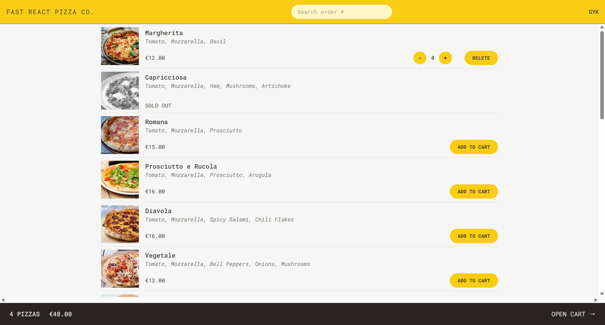
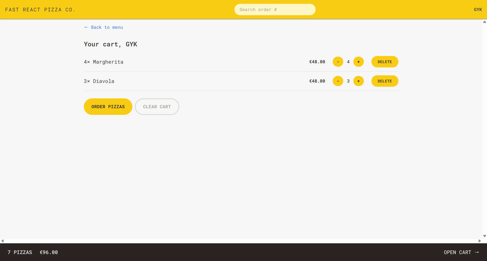
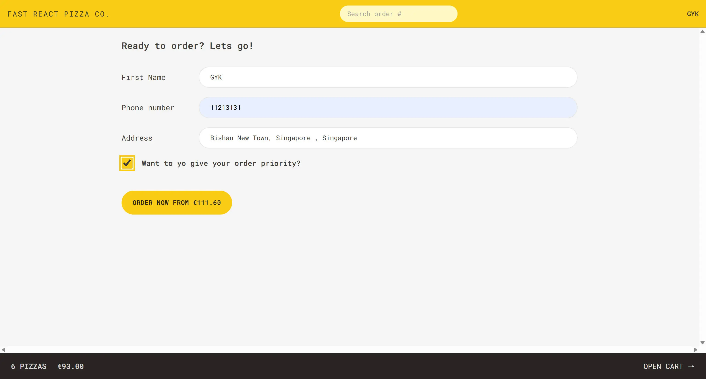
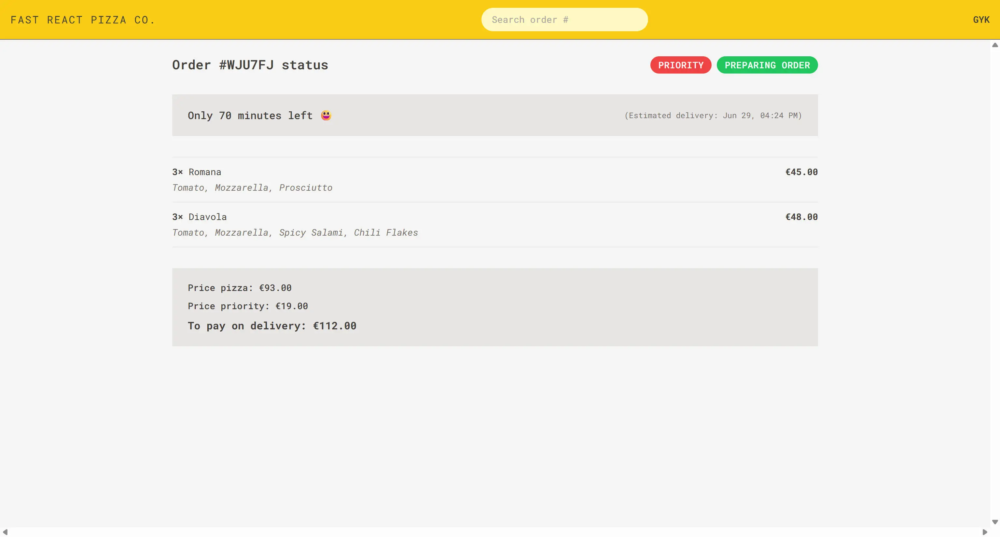

## 项目概述

Fast React Pizza 是一个功能完整的在线披萨订购应用，这是一个**练习项目**，专门用于学习和实践现代React开发技术。虽然是一个学习性质的"甜品级"小demo，但它完整地展现了现代React应用的核心开发模式和最佳实践。

项目实现了用户友好的披萨订购流程：从浏览菜单、添加购物车、填写订单信息到完成支付的完整体验。通过这个项目，开发者可以深入理解React生态系统中的各种核心概念和工具。

## 技术栈

项目采用现代化的React技术栈：

- **前端框架**: React 18 配合 Vite 构建工具
- **状态管理**: Redux Toolkit 用于全局状态管理
- **路由管理**: React Router v6 (使用最新的loader/action模式)
- **样式方案**: Tailwind CSS
- **API集成**: RESTful API + 地理位置服务
- **开发工具**: ESLint + Prettier + PostCSS

## 核心功能模块

### 1. 菜单浏览系统



完整的披萨菜单展示功能：

- 从外部API动态加载菜单数据
- 披萨信息展示（名称、配料、价格、库存状态）
- 直接添加到购物车功能
- 售罄商品的状态管理

### 2. 购物车管理



基于Redux Toolkit的购物车状态管理：

- 商品添加/删除操作
- 数量调整（增加/减少）
- 实时价格计算
- 购物车概览显示
- 清空购物车功能

### 3. 订单创建流程



完整的订单处理系统：

- 用户信息收集（姓名、电话、地址）
- 地理位置自动获取功能
- 订单优先级选择
- 订单信息确认和提交

### 4. 订单查询与管理



订单状态跟踪功能：

- 通过订单ID查询订单状态
- 订单详情展示
- 订单优先级后续调整
- 配送状态更新

## 架构设计亮点

### 1. 现代React路由模式

项目采用React Router v6的最新特性：

```javascript
// 使用loader进行数据预加载
{
  path: '/menu',
  element: <Menu />,
  loader: menuLoader,
  errorElement: <Error />,
}

// 使用action处理表单提交
{
  path: '/order/new',
  element: <CreateOrder />,
  action: createOrderAction,
}
```

实现了"render as you fetch"策略，提升用户体验。

### 2. Redux Toolkit状态管理

采用现代Redux模式，使用createSlice简化状态管理：

**购物车状态管理**：

- 商品的增删改查操作
- 派生状态计算（总数量、总价格）
- 不可变更新的最佳实践

**用户状态管理**：

- 异步thunk处理地理位置获取
- loading/error状态的统一管理
- 本地状态与全局状态的协调

### 3. API服务层架构

构建了清晰的API服务抽象：

- 统一的错误处理机制
- RESTful API调用封装
- 外部服务集成（地理位置API）

### 4. 组件化设计

采用功能导向的组件组织结构：

```
features/
├── cart/          # 购物车功能模块
├── menu/          # 菜单功能模块
├── order/         # 订单功能模块
└── user/          # 用户功能模块
```

每个功能模块包含完整的组件、状态管理和业务逻辑。

## 数据层设计

### 外部API集成

项目集成了真实的外部服务：

- **披萨菜单API**: `react-fast-pizza-api.onrender.com`
- **地理位置服务**: BigDataCloud反向地理编码API
- **错误边界**: 完整的网络错误处理机制

### 状态管理策略

采用分层的状态管理方案：

- Redux Store管理全局状态（用户、购物车）
- URL参数管理路由状态
- 组件本地状态处理UI交互
- LocalStorage持久化用户偏好

## 用户体验特色

### 1. 响应式设计

基于Tailwind CSS构建的移动优先响应式界面。

### 2. 实时反馈

- 购物车数量实时更新
- 订单状态即时反馈
- 地理位置获取进度提示

### 3. 错误处理

完善的错误边界和用户友好的错误信息展示。

## 学习价值

作为一个React练习项目，Fast React Pizza展示了：

### 现代React开发模式

- 函数组件和Hooks的使用
- 自定义Hooks的抽象
- 组件组合和复用模式

### 状态管理最佳实践

- Redux Toolkit的现代用法
- 异步状态处理
- 派生状态的计算

### 路由和数据获取

- React Router v6的新特性
- 数据预加载策略
- 错误边界的实现

### 工程化实践

- 模块化的项目结构
- 代码分离和关注点分离
- 现代构建工具的使用

## 项目局限性

作为一个学习项目，该应用具有以下局限性：

- 无真实的支付系统集成
- 缺少用户认证和会话管理
- 数据持久化依赖外部API
- 未实现复杂的业务逻辑（如库存管理、促销系统等）
- UI设计相对简单，主要关注功能实现

## 技术收获

通过构建这个项目，开发者可以掌握：

1. **React 18**的核心特性和开发模式
2. **Redux Toolkit**的现代状态管理方法
3. **React Router v6**的数据加载和路由管理
4. **Tailwind CSS**的实用程序优先设计方法
5. **现代JavaScript**的异步编程模式
6. **API集成**和错误处理的最佳实践

## 结语

Fast React Pizza虽然是一个练习性质的项目，但它完整地展现了现代React应用开发的核心要素。通过构建这样一个"甜品级"的demo，开发者可以在实践中深入理解React生态系统，为构建更复杂的生产级应用打下坚实基础。

项目的价值不在于其商业复杂性，而在于它提供了一个完整的学习路径，让开发者能够循序渐进地掌握现代前端开发的核心技能。

**GitHub 仓库：** [Fast React Pizza Repository](https://github.com/izumi0uu/fast-react-pizza)
