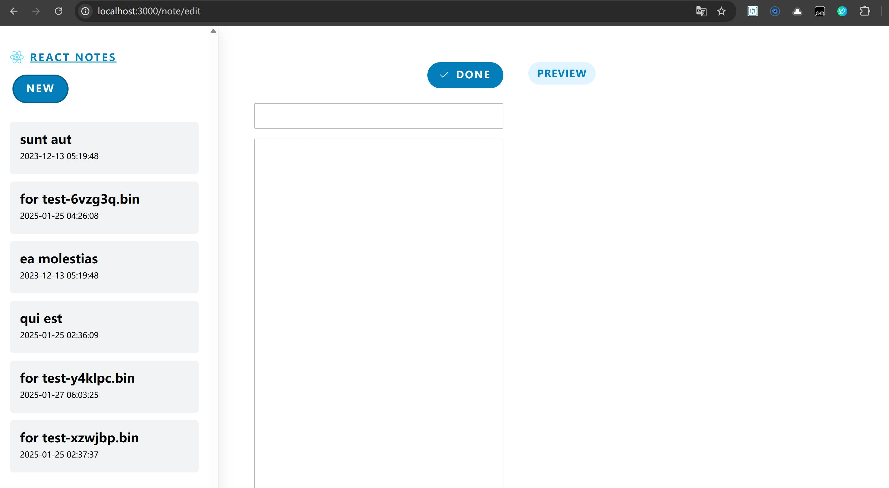
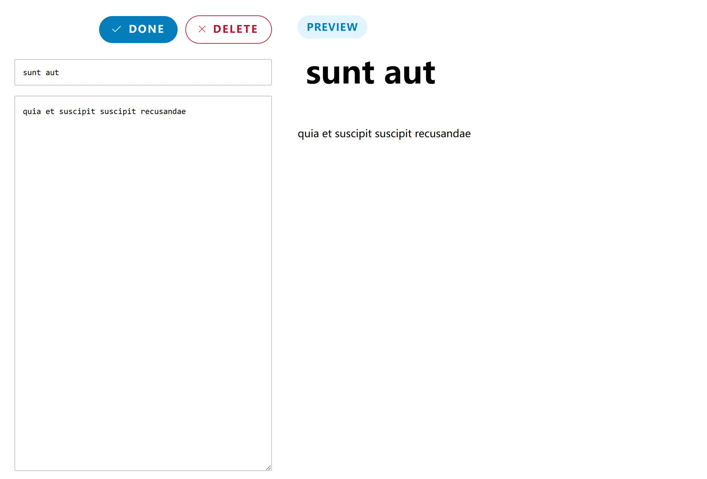
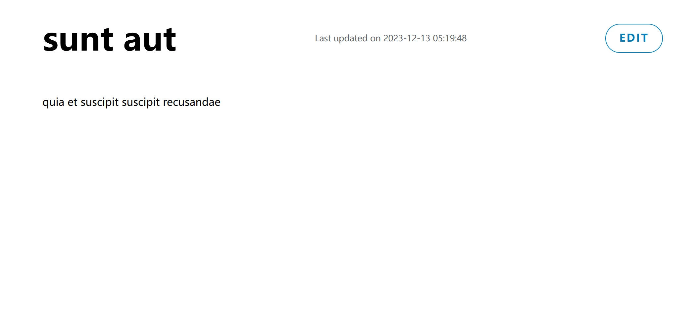

## 项目概述

React Notes 是一个精简的笔记管理应用，采用现代 Next.js 技术栈构建。这个项目的定位是一个**学习型 Demo**，专门用于实践和理解 Next.js 15 的新特性，包括 App Router、React Server Components 以及现代 React 开发模式。

虽然功能相对简单，但麻雀虽小五脏俱全——涵盖了现代 Web 应用的核心要素：数据持久化、服务器端渲染、动态路由和用户交互。

## 技术栈

### 核心框架

- **Next.js 15.0.3**: 使用最新的 App Router 架构
- **React 19.0.0-rc**: 体验 React 的最新特性
- **Redis (ioredis 5.4.1)**: 轻量级数据存储解决方案

### 功能增强

- **Marked 15.0.3**: Markdown 文本解析和渲染
- **Sanitize-HTML 2.13.1**: HTML 内容安全清理
- **DayJS 1.11.13**: 日期时间处理

### 开发工具

- **ESLint**: 代码质量检查
- **Next.js ESLint Config**: Next.js 专用代码规范

## 应用架构

### 简洁的布局设计

应用采用经典的双栏布局：

- **左侧边栏**: 笔记列表导航，支持笔记预览
- **右侧主区**: 笔记详情展示和编辑界面

这种设计在保持简洁的同时，提供了直观的用户体验。

### Next.js App Router 实践

项目完全采用 Next.js 的 App Router 架构：

```
app/
├── layout.js                    # 根布局
├── page.js                      # 首页
├── note/
│   ├── [id]/
│   │   ├── page.jsx            # 笔记详情页
│   │   └── loading.jsx         # 加载状态
│   └── edit/
│       ├── page.jsx            # 新建笔记
│       ├── [id]/page.jsx       # 编辑笔记
│       └── loading.jsx         # 编辑加载状态
└── components/                  # 可复用组件库
```

## 核心功能

### 1. 笔记管理

- **创建笔记**: 支持新建空白笔记
  

- **编辑笔记**: Markdown 语法编辑器
  

- **查看笔记**: 实时 Markdown 渲染预览
  

- **删除笔记**: 一键删除操作

### 2. 数据持久化

使用 Redis 作为数据存储方案，虽然简单但足够可靠：

```javascript
// 核心数据操作
export async function getAllNotes() {
  const data = await redis.hgetall("notes");
  // 首次启动时初始化示例数据
  if (Object.keys(data).length == 0) {
    await redis.hset("notes", initialData);
  }
  return await redis.hgetall("notes");
}
```

### 3. Markdown 支持

集成 Marked 库提供完整的 Markdown 处理能力：

- 实时语法解析
- HTML 安全渲染
- 支持常见 Markdown 语法

## 技术亮点

### 1. React Server Components 实践

充分利用 Next.js 15 的 Server Components 特性：

- 服务器端数据获取
- 减少客户端 JavaScript 体积
- 提升首屏加载性能

### 2. 动态路由设计

实现了灵活的路由系统：

- `/note/[id]` - 笔记详情页
- `/note/edit/[id]` - 编辑特定笔记
- `/note/edit` - 创建新笔记

### 3. 加载状态处理

为每个页面配置了专门的 loading.jsx，提供更好的用户体验。

## 学习价值

### 作为 Next.js 学习项目

这个 Demo 特别适合以下学习场景：

1. **App Router 入门**: 理解新的路由机制和文件结构
2. **Server Components**: 体验服务器端组件的开发模式
3. **数据获取**: 学习现代 React 的数据流管理
4. **组件设计**: 实践可复用组件的架构思路

### 技术债务和改进空间

诚实地说，作为一个学习 Demo，项目还有不少可以改进的地方：

- **用户认证**: 目前没有用户系统
- **数据验证**: 缺少输入验证和错误处理
- **响应式设计**: UI 适配还不够完善
- **性能优化**: 可以加入缓存和懒加载等优化
- **测试覆盖**: 缺少单元测试和集成测试

## 部署和运行

### 本地开发

```bash
# 安装依赖
npm install

# 启动 Redis (需要本地安装 Redis)
redis-server

# 启动开发服务器
npm run dev
```

### 生产部署

```bash
# 构建项目
npm run build

# 启动生产服务器
npm start
```

## 总结反思

React Notes 虽然是一个甜品级的小 Demo，但它成功地展示了现代 Next.js 开发的核心概念。通过这个项目，可以深入理解：

- Next.js App Router 的实际应用
- React Server Components 的开发体验
- 全栈 React 应用的基本架构
- 现代 Web 开发的最佳实践

对于想要学习 Next.js 的开发者来说，这个项目提供了一个很好的起点。它足够简单，不会被复杂的业务逻辑干扰学习重点；同时又足够完整，涵盖了真实应用的基本要素。

**重要提醒**: 这个项目纯粹是为了学习和实践目的而创建，不适合直接用于生产环境。如果要用于实际项目，需要添加更多的安全性、错误处理和性能优化措施。

## 链接

**GitHub 仓库**: [React Notes Demo](https://github.com/your-username/react-notes)

---

_这是一个学习项目，专注于 Next.js 技术栈的实践和探索。欢迎 Fork 和改进！_
