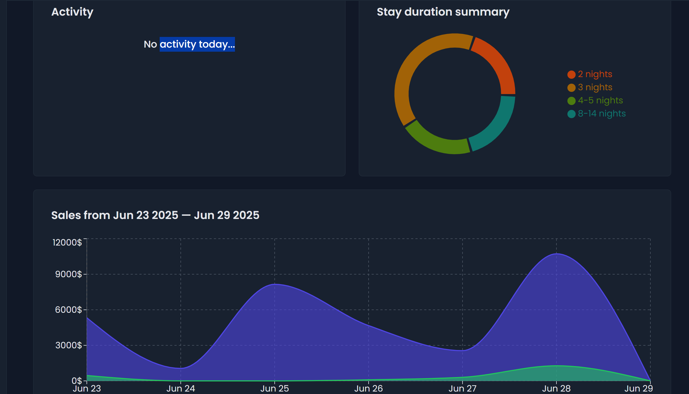
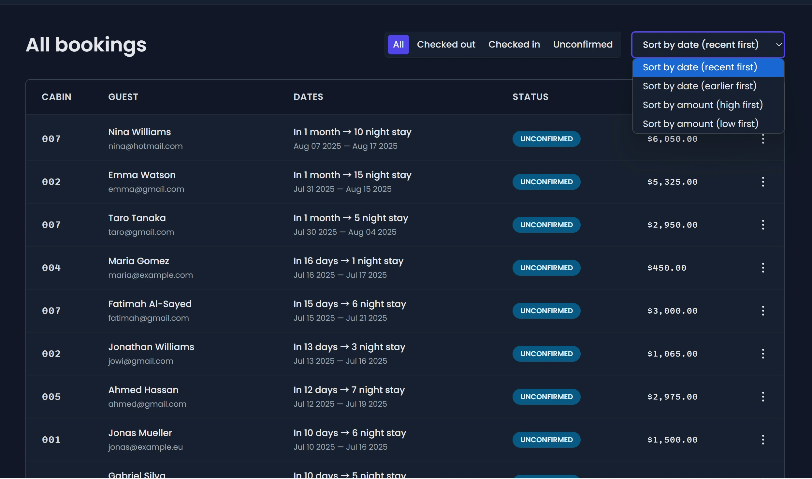
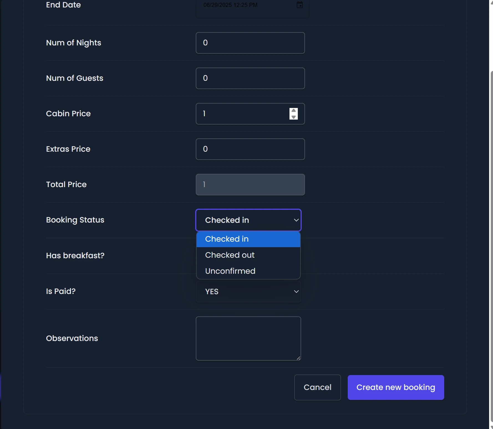
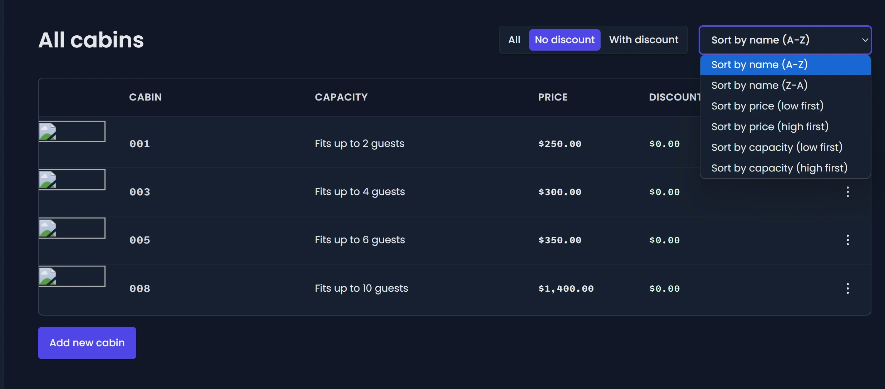
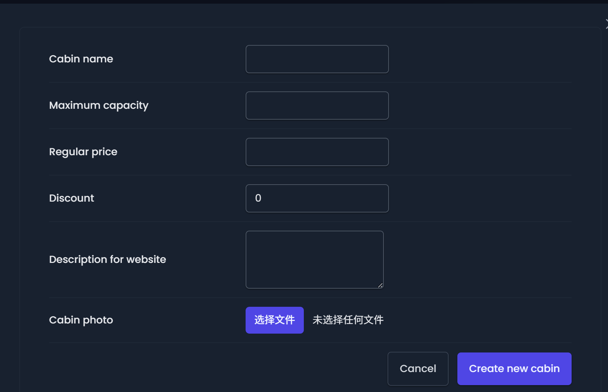

## 项目概述

The Wild Oasis 是一个现代化的酒店/度假村管理系统，专门为管理小木屋式住宿而设计。这是一个内部管理工具，供酒店工作人员使用，用于管理预订、客房、客人信息和系统设置。

## 技术栈

项目采用现代化的前端技术栈：

- **前端框架**: React 18 配合 Vite 构建工具
- **后端服务**: Supabase (Backend-as-a-Service)
- **状态管理**: React Query 用于服务器状态管理，React Context 用于客户端状态
- **样式方案**: Styled Components
- **路由**: React Router v6
- **表单处理**: React Hook Form
- **UI组件**: 自定义设计系统 [2]

## 核心功能模块

### 1. 仪表板 (Dashboard)

应用的中心枢纽，提供业务分析和概览功能：

- 实时统计数据（预订量、销售额、入住率、占用率）
- 销售趋势图表
- 住宿时长分析
- 今日活动概览（入住/退房）

### 2. 预订管理 (Booking Management)

完整的预订生命周期管理：

- 预订列表查看，支持筛选和分页
- 预订详情查看
- 入住/退房流程
- 预订状态更新
- 客人信息关联

### 3. 小木屋管理 (Cabin Management)

住宿单元的完整CRUD操作：

- 小木屋信息展示（名称、容量、价格、描述）
- 图片上传和管理
- 价格和折扣设置
- 复制和删除功能

### 4. 用户管理

员工账户管理功能：

- 新用户注册
- 用户认证和授权
- 权限控制

### 5. 系统设置

应用配置管理：

- 主题切换（深色/浅色模式）
- 系统参数配置

## 架构设计亮点

### 1. 模块化架构

项目采用功能模块化的架构设计，每个业务领域都有独立的模块结构：

- `features/` - 按业务功能组织的特性模块
- `pages/` - 页面组件作为功能组合的入口
- `ui/` - 可复用的UI组件库
- `services/` - API服务层抽象

### 2. 多层状态管理

采用分层的状态管理策略：

- React Query 处理服务器状态
- Context API 管理全局客户端状态
- URL参数管理筛选和分页状态
- 本地存储处理用户偏好设置

### 3. 路由保护机制

实现了两级路由结构，区分公开路由和受保护路由：

- 受保护路由需要用户认证
- 统一的应用布局包装
- 自动重定向到登录页面

## 数据层设计

### Supabase 集成

项目深度集成 Supabase 作为后端解决方案：

- PostgreSQL 数据库用于存储业务数据
- 实时认证和用户管理
- 文件存储服务用于图片上传
- 行级安全策略保护数据

### API 服务层

每个业务实体都有专门的API服务模块：

- 统一的错误处理机制
- 支持复杂查询和关联查询
- 原子操作保证数据一致性

## 用户体验特色

### 1. 响应式设计

全面适配不同设备屏幕尺寸，提供一致的用户体验。

### 2. 深色模式支持

内置主题切换功能，支持浅色和深色模式，提升用户使用舒适度。

### 3. 实时数据更新

利用 React Query 的缓存机制，提供实时的数据同步和乐观更新。

## 链接

**在线演示：** [https://the-wild-oasis-demo.netlify.app](https://the-wild-oasis-demo.netlify.app)

**GitHub 仓库：** [https://github.com/izumi0uu/the-wild-oasis](https://github.com/izumi0uu/the-wild-oasis)
