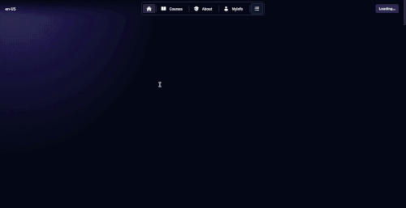
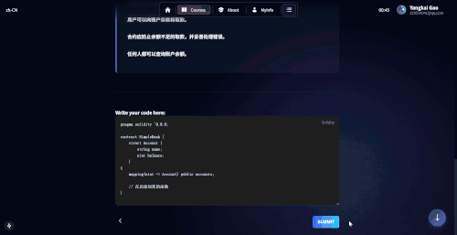

## 项目概述

Decode 是一个仿[WTF Academy](https://www.wtf.academy/)的Web3教育平台，专注于提供高质量的在线学习体验。该平台将传统的在线教育与区块链技术相结合，为学习者提供了一个全新的学习环境。用户可以通过Web3钱包登录，完成课程学习，参与AI交互式测验，并获得SBT（Soul Bound Token）认证，构建了一个完整的去中心化学习生态系统。

## 技术栈

项目采用现代化的全栈技术架构：

### 前端技术

- **框架**: Next.js 15 配合 React 18 和 TypeScript
- **构建工具**: Turbopack 和 Vite 用于开发和构建优化
- **状态管理**: TanStack Query 用于服务器状态管理，React Context 用于全局状态
- **UI组件**: Once UI 设计系统 + 自定义组件库
- **样式方案**: Sass + CSS Modules + PostCSS
- **动画**: Framer Motion 提供流畅的交互动画
- **Web3集成**: Web3Auth 支持多种钱包连接

### 后端技术

- **CMS系统**: Strapi 5.10.2 提供内容管理
- **数据库**: MySQL 2 用于数据存储
- **认证系统**: 双重认证体系（传统认证 + Web3钱包认证）
- **文件存储**: 集成媒体文件管理系统
- **API架构**: RESTful API 设计

### 开发工具

- **代码质量**: Biome 用于代码格式化和 lint
- **类型检查**: TypeScript 5 确保类型安全
- **包管理**: npm 包管理器
- **版本控制**: Git 版本控制

## 核心功能模块

### 1. 智能首页系统



首页作为用户的第一印象，提供了丰富的内容展示：

- **课程预览轮播**: 展示精选课程，支持自动播放和手动切换
- **热门课程推荐**: 基于用户行为和课程热度的智能推荐
- **分类导航**: 直观的课程分类系统，方便用户快速找到感兴趣的内容
- **实时数据更新**: 使用 Suspense 和服务端渲染确保数据实时性
- **响应式设计**: 完美适配桌面端和移动端设备

### 2. 全面的课程管理系统


课程页面提供了完整的课程浏览和管理功能：

- **课程列表展示**: 支持分页、筛选和搜索功能
- **课程详情页**: 详细展示课程信息、学习目标、前置要求等
- **难度分级**: 初级、中级、高级三个难度等级
- **学习路径**: 结构化的课程学习路径设计
- **进度追踪**: 实时跟踪学习进度和完成状态
- **标签系统**: 多维度的课程标签分类

### 3. 创新的双重认证系统


融合传统认证与Web3技术的双重登录体系：

#### Web3钱包认证

- **多钱包支持**: 支持MetaMask、WalletConnect等主流钱包
- **一键连接**: 通过Web3Auth实现便捷的钱包连接
- **去中心化身份**: 基于区块链的身份验证机制
- **安全性保障**: 私钥安全存储，用户完全控制

#### 传统认证方式

- **第三方登录**: 支持Google、GitHub等主流平台
- **邮箱认证**: 传统的邮箱密码登录方式
- **统一用户体验**: 不同认证方式的用户体验保持一致

### 4. 个性化个人中心

个人中心提供全面的用户信息管理：

- **个人资料管理**: 头像、姓名、邮箱、个人简介编辑
- **钱包地址展示**: 显示关联的Web3钱包地址
- **学习进度统计**:
  - 已完成课程数量和比例
  - 进行中的课程追踪
  - 总学习时长统计
  - 课程完成率可视化
- **个人成就展示**: 学习徽章和等级系统
- **SBT认证展示**: 区块链认证证书管理

### 5. 沉浸式课程学习体验


课程学习页面专注于提供最佳的学习体验：

- **结构化内容展示**: 支持Markdown渲染的课程内容
- **多媒体支持**: 图片、视频、音频等多种媒体格式
- **学习进度保存**: 自动保存学习进度，支持断点续学
- **课程导航**: 上一课/下一课快速切换
- **侧边栏目录**: 课程章节目录导航
- **学习笔记**: 用户可以添加个人学习笔记
- **代码高亮**: 支持多种编程语言的语法高亮

### 6. 交互式测验系统


智能测验系统提供多样化的评估方式：

- **多种题型支持**: 单选题、多选题、填空题、编程题
- **智能计时**: 可配置的测验时间限制
- **实时进度**: 测验进度实时显示
- **题目材料**: 支持题目附带参考材料
- **答案解析**: 详细的答案解释和知识点说明
- **AI辅助**: 集成主题AI机器人提供学习指导

### 7. 智能测验结果分析



测验结果页面提供深度的学习分析：

- **成绩统计**: 得分、正确率、用时等详细数据
- **错题分析**: 错误题目的详细解析和改进建议
- **知识点掌握**: 各知识点的掌握程度分析
- **学习建议**: 基于测验结果的个性化学习建议
- **历史对比**: 与历史成绩的对比分析
- **证书颁发**: 达到标准后自动颁发学习证书

### 8. 强大的内容管理系统

基于Strapi构建的内容管理系统：

#### Content Type Builder

- **可视化模型设计**: 通过拖拽方式设计数据模型
- **丰富的字段类型**: 文本、数字、日期、关系、媒体等多种字段
- **关系映射**: 课程、课时、测验、用户等实体间的复杂关系
- **动态字段**: 支持动态添加和修改字段结构
- **版本控制**: 内容版本管理和发布控制

#### 内容管理功能

- **课程管理**: 创建、编辑、发布课程内容
- **课时管理**: 管理课程下的具体课时
- **测验管理**: 创建和管理测验题目
- **用户管理**: 用户信息和权限管理
- **分类管理**: 课程分类和标签管理
- **贡献者管理**: 讲师和内容创作者管理

### 9. 媒体文件管理系统

完整的媒体文件管理解决方案：

- **文件上传**: 支持拖拽上传和批量上传
- **图片优化**: 自动压缩和格式转换
- **文件分类**: 按类型、课程、用户等维度分类
- **访问控制**: 细粒度的文件访问权限控制
- **CDN集成**: 支持第三方CDN加速
- **存储管理**: 文件存储空间管理和清理

## 架构设计亮点

### 1. 微服务架构设计

项目采用前后端分离的微服务架构：

- **前端应用**: Next.js应用处理用户界面和交互
- **CMS服务**: Strapi提供内容管理和API服务
- **认证服务**: 独立的认证微服务处理用户身份
- **文件服务**: 专门的媒体文件处理服务
- **AI服务**: 集成的AI服务提供智能辅助

### 2. 多层状态管理策略

采用分层的状态管理架构：

- **服务器状态**: TanStack Query处理API数据缓存
- **全局状态**: React Context管理用户认证状态
- **本地状态**: useState/useReducer处理组件状态
- **URL状态**: 路由参数管理页面状态
- **持久化状态**: localStorage保存用户偏好

### 3. 响应式设计系统

基于Once UI构建的响应式设计系统：

- **组件库**: 可复用的UI组件库
- **设计令牌**: 统一的设计变量系统
- **主题切换**: 支持深色/浅色模式
- **断点管理**: 灵活的响应式断点
- **无障碍支持**: 完整的无障碍功能

## 数据层设计

### 实体关系模型

项目构建了完整的教育数据模型：

```
用户 (User)
├── 个人信息 (Profile)
├── 学习进度 (Progress)
└── 认证信息 (Authentication)

课程 (Course)
├── 基本信息 (Basic Info)
├── 课时列表 (Lessons)
├── 测验集合 (Quizzes)
└── 学习资源 (Resources)

测验 (Quiz)
├── 题目集合 (Questions)
├── 选项管理 (Options)
└── 答案解析 (Explanations)
```

## 用户体验特色

### 1. 性能优化

- **服务端渲染**: Next.js SSR提升首屏加载速度
- **静态生成**: ISR增量静态再生成
- **代码分割**: 自动代码分割和懒加载
- **图片优化**: Next.js Image组件自动优化
- **缓存策略**: 多级缓存提升访问速度

### 2. 交互体验

- **流畅动画**: Framer Motion提供丝滑的动画效果
- **加载状态**: Suspense和Skeleton提供优雅的加载体验
- **错误边界**: 完整的错误处理和恢复机制
- **离线支持**: PWA特性支持离线访问
- **键盘导航**: 完整的键盘导航支持

### 3. 个性化功能

- **主题定制**: 用户可选择深色/浅色主题
- **语言支持**: 国际化支持多语言切换
- **学习偏好**: 个性化的学习偏好设置
- **进度同步**: 跨设备的学习进度同步
- **智能推荐**: 基于学习行为的内容推荐

## 链接信息

**项目地址**: [https://github.com/izumi0uu/Decode](https://github.com/izumi0uu/Decode)

**文档地址**: [https://deepwiki.com/izumi0uu/DeCode](https://deepwiki.com/izumi0uu/DeCode)
